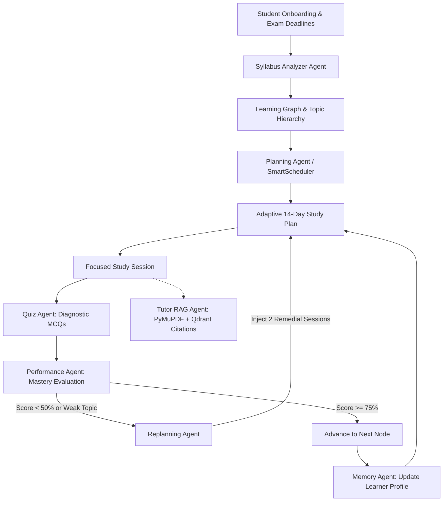
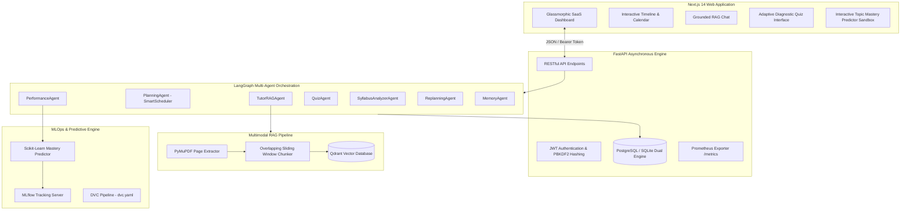

# StudyGen — Agentic AI Study Planner 🎓🤖

[](https://github.com/studygen/studygen/actions/workflows/ci.yml)
[](https://fastapi.tiangolo.com)
[](https://langchain-ai.github.io/langgraph/)
[](https://nextjs.org)
[](https://qdrant.tech)
[](https://mlflow.org)

> **"StudyGen is an adaptive AI learning assistant that doesn't just generate a static timetable. It continuously observes a student's goals, syllabus, available time, study progress, quiz performance, weak topics, uploaded learning material, and upcoming exams, then plans, evaluates, remembers, and replans the student's learning journey."**

---

## 🌟 The Intelligence Loop

Unlike basic LLM wrappers (`User → LLM → Response`), StudyGen is powered by **LangGraph** orchestrating 7 specialized autonomous agents over a shared state graph:

$$\text{PLAN} \longrightarrow \text{LEARN} \longrightarrow \text{MEASURE} \longrightarrow \text{REMEMBER} \longrightarrow \text{ADAPT} \longrightarrow \text{REPLAN}$$



---

## 🏛️ System Architecture



---

## 🤖 The 7 Specialized Agents

1. **Syllabus Analyzer Agent**: Parses raw unstructured course syllabi, deconstructs them into topics and subtopics, estimates difficulty ($0.1\text{--}1.0$), and maps prerequisite dependency edges.
2. **Planning Agent (SmartScheduler)**: Constraint-based heuristic optimizer balancing daily available hours (e.g. 3 hrs/day), preferred study windows, spaced repetition intervals, 10-minute rest breaks, and upcoming exam deadlines.
3. **Tutor RAG Agent**: Answers student questions grounded strictly in uploaded study notes and textbooks with page citations and zero hallucination.
4. **Quiz Agent**: Synthesizes challenging academic MCQs and conceptual questions tailored to individual weak areas.
5. **Performance Agent**: Evaluates student test submissions, calculates composite topic mastery, and triggers conditional transitions.
6. **Replanning Agent**: Detects when a student falls behind or fails a topic ($<50\%$), automatically shifting upcoming days to inject remedial revisions without derailing exam preparedness.
7. **Memory Agent**: Persists learner habits, strengths, weaknesses, and preferred pacing across sessions.

---

## 🧠 Adaptive Mastery & ML Predictor

StudyGen employs a transparent, modular formula:

$$\text{mastery} = 0.4 \times \text{quiz\_performance} + 0.2 \times \text{completion} + 0.2 \times \text{consistency} + 0.2 \times \text{recent\_score}$$

Alongside the transparent formula, an offline-trained **Random Forest Classifier** tracks the probability of a student mastering a topic before the exam:
- **Features**: `quiz_score_avg`, `study_duration_hrs`, `session_count`, `topic_difficulty`, `completion_rate`, `recent_quiz_score`, `revision_frequency`.
- **Metrics Evaluated**: Accuracy ($66\%$), Precision ($62\%$), Recall ($54\%$), F1 ($0.57$), ROC-AUC ($0.73$).
- **Logged with**: MLflow tracking server and DVC pipeline.

---

## 🚀 10-Step Hackathon Demo Scenario

You can demonstrate the complete end-to-end intelligence loop in 2 minutes:

1. **Click "Load Demo Scenario"** in the top navbar.
2. **Observe Constraints**: Student has final exams in 20 days, 3.0 available study hours/day in the Evening window.
3. **Inspect Subjects**: Data Structures & Algorithms, DBMS, Operating Systems, Machine Learning.
4. **Examine Binary Trees**: Initial mastery is set to low ($45\%$).
5. **Inspect Smart Schedule**: Every scheduled block has an explainable reason (*"Scheduled because low mastery (45%) + exam in 20 days"*).
6. **Take Diagnostic Quiz**: Answer 4 questions on Binary Trees and AVL rotations.
7. **Submit Quiz**: Score $45\%$ triggers `PerformanceAgent`.
8. **Watch Adaptive Replanning**: `ReplanningAgent` dynamically shifts future days, adding 2 remedial sessions and reducing repetition on mastered topics (Arrays: 85%).
9. **Chat with AI Tutor**: Ask *"Explain AVL trees using my notes"*. The Tutor RAG agent retrieves exact excerpts from `DSA_Lecture_Notes_Trees_AVL.pdf` (Pages 1 and 2) with grounded citations!
10. **Simulate ML Mastery**: Visit the **ML & Analytics** tab to test feature sliders and calculate live Random Forest retention probabilities.

---

## 🛠️ Technology Stack

| Layer | Technologies |
| :--- | :--- |
| **Frontend** | Next.js 14, React 18, TypeScript, Tailwind CSS, Lucide React, Recharts |
| **Backend** | Python 3.11+, FastAPI, SQLAlchemy 2.0 (Async), Pydantic v2, aiosqlite / asyncpg |
| **Agent Orchestration** | LangGraph, LangChain Core |
| **RAG & Vector DB** | PyMuPDF (`fitz`), Qdrant Vector DB, In-Memory Cosine Fallback |
| **LLM Layer** | Abstract Provider Architecture: `OpenAIProvider`, `GeminiProvider`, `MockProvider` |
| **Machine Learning** | Scikit-Learn (Random Forest, Logistic Regression), Pandas, NumPy, Joblib |
| **MLOps & DevOps** | MLflow, DVC, Docker, Docker Compose, Prometheus, Grafana, GitHub Actions |

---

## ⚡ Quickstart & Setup Instructions

### 1. Clone the repository
```bash
git clone https://github.com/studygen/studygen.git
cd studygen
```

### 2. Configure Environment Variables
```bash
cp .env.example .env
```
*(By default, `DEFAULT_LLM_PROVIDER=mock` and `QDRANT_URL=:memory:`, so the application runs 100% out of the box with zero external dependencies or API keys required!)*

### 3. Run Backend (FastAPI)
```bash
cd backend
python -m pip install -r requirements.txt
uvicorn app.main:app --reload --port 8000
```
- API Docs: [http://localhost:8000/docs](http://localhost:8000/docs)
- Prometheus Metrics: [http://localhost:8000/metrics](http://localhost:8000/metrics)

### 4. Run Frontend (Next.js)
```bash
cd frontend
npm install
npm run dev
```
- Open [http://localhost:3000](http://localhost:3000) in your browser.
- Click **"1-Click Hackathon Demo Login"** to start immediately.

### 5. Run ML Model Training & MLflow Logging
```bash
python ml/training/train.py
```

### 6. Run Test Suite
```bash
cd backend
python -m pytest -v
```

### 7. Run Full Docker Stack
```bash
docker-compose up --build
```
Services spun up:
- Frontend: `http://localhost:3000`
- Backend: `http://localhost:8000`
- MLflow: `http://localhost:5000`
- Prometheus: `http://localhost:9090`
- Grafana: `http://localhost:3001`
- Qdrant: `http://localhost:6333`
- PostgreSQL: `localhost:5432`

---

## 🔒 Security & Privacy

- PBKDF2 SHA-256 cryptographic password hashing with unique salt.
- Cryptographically signed JWT Bearer authentication tokens.
- Strict input validation via Pydantic models.
- Learner memory agent preserves zero sensitive personal data.

---

## 📜 License
MIT License. Built for hackathon demonstration.
